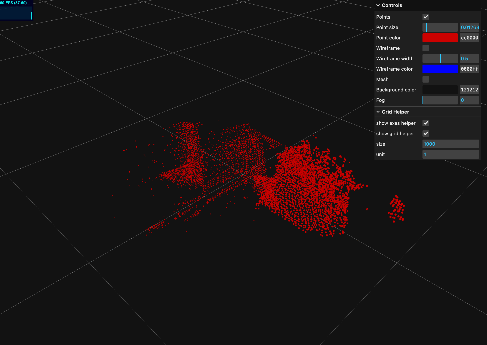

# PointCloud Registration

This package implements the ROS point cloud registration service node based on open3d.

这个功能包是基于 open3d 实现了 ROS 点云配准服务节点。

---

# Contributors

The hardware and testing facilities for this project were provided by the `Institute of Automation, Chinese Academy of Sciences`. The following individuals made significant contributions to the development of this project, and we would like to thank them for their efforts:

该工程由 `中国科学院自动化研究所` 提供硬件与测试场地，同时以下人员在该项目的开发中做出了巨大贡献，在此感谢他们的付出：

[WenJiang Xu 徐文江](https://github.com/HEA1OR)，[PengFei Yi 易鹏飞](https://github.com/alfie010)，[JingKai Xu 徐靖凯](https://github.com/Triumphant-strain)，[XingYu Wang 王行宇](https://github.com/xywang227)，[YaNan Hao 郝亚楠](https://github.com/haoyanan2024)，[YuWei Wang 王雨薇](https://github.com/YuweiWang2002)


----
# How to Use

## Step1. Clone this repo

Enter your workspace and pull the repository. Assume your workspace is `reg_ws`:

进入到你的工作空间中拉取该仓库，假设你的工作空间为 `reg_ws`：

```bash
$ cd reg_ws/src
$ git clone xxx
```

---

## Step2. Create conda env

Create a new conda environment and install the following dependencies:

新建一个 conda 环境并安装以下依赖:

```bash
$ conda create -n o3d python=3.10
$ pip install open3d pyyaml rospkg numpy==1.24.3
```

---

## Step3. Build Workspace

Return to the workspace directory and compile the space. After the compilation is successful, activate the conda environment:

返回到工作空间目录下编译该空间，编译成功后激活 conda 环境：

```bash
(base) $ cd reg_ws
(base) $ conda deactivate 
(base) $ catkin_make

(base) $ conda activate o3d
```

## Step4. [optional] Run Test

Before using it, you can run the test script to ensure that the open3d registration function is normal. If you do not want to open the GUI interface, modify the `DISPLAY` variable in the script to `False`:

在使用之前可以先运行测试脚本以确保 open3d 配准功能正常。如果你不想要打开 GUI 界面，修改脚本中的 `DISPLAY` 变量为 `False`：

```bash
(o3d) $ python src/pointcloud_registration/scripts/test_without_ros.py demo
```

|Before Reg|After Reg|
|--|--|
|||


If you get `Segmentation Fault` after running, it may be caused by the `numpy` version. Downgrade it to `1.xx` version:

如果你在运行后遇到了 `Segmentation Fault` 问题，有可能是由于 `numpy` 版本导致的，将其降级为 `1.xx` 版本：

```bash
(o3d) $ pip install -U numpy==1.24.3
```

----

## Step5. [optional] Create Target File

We recommend using another open source RGBD reconstruction repository to create the target point cloud, or if you have an iPhone device with LiDAR, you can download the `3D Scanner` software from the App Store to scan the object of interest for reconstruction.

我们建议使另外一个开源的 RGBD 重建仓库创建 target 点云，或者如果你有带有 Lidar 的 iPhone 设备可以下载 App Store 中的 `3D Scanner` 软件扫描你感兴趣的物体用于重建。

If you do not meet the above conditions, run the following node to collect the point cloud of the current frame:

如果上述条件你都不具备，那么运行下面的节点来采集当前帧点云：

```bash
(conda) $ roslaunch pointcloud_registration allocate_pcd.launch
```

Call the service and pass in the parameters. If you don't modify the `min max` parameters, the bounding box range will be used as `x=[-1.0,1.0], y=[-1.0,1.0], z=[-1.0,1.0]`:

调用服务并传入参数，如果你不修改 `min max` 参数则会使用 bounding box 范围为 `x=[-1.0,1.0], y=[-1.0,1.0], z=[-1.0,1.0]`：

```bash
(conda) $ rosservice call /pointcloud_accumulator_node/save_cloud "{filename: 'demo', min_x: 0.0, max_x: 0.
0, min_y: 0.0, max_y: 0.0, min_z: 0.0, max_z: 0.0}" 

success: True
message: "Successfully saved point cloud with 6705 points to /home/orin/Desktop/point_reg/src/pointcloud_registration/pcd_files/demo.pcd"
```




---
## Step6. Use Point Cloud Register

Before executing the script, you need to make sure that your target point cloud file is in the `pcd_files` folder. If you need to save the target and source point clouds currently in use for debugging, you can modify the `write_file` parameter in the launch file.

在执行脚本之前需要确保 `pcd_files` 文件夹中有你的 target 点云文件，如果你需要保存当前正在使用的 target 和 source 点云用于 debug，可以修改 launch 文件中的 `write_file` 参数。

```bash
(o3d) $ roslaunch pointcloud_registration registration.launch
```

Call the service and pass the target point cloud file name as the `target_cloud_name` parameter:

调用服务并将 target 点云文件名作为参数 `target_cloud_name` 传入：

```bash
(o3d) $ rosservice call /pointcloud_registration_node/register "{target_cloud_name: 'demo', voxel_size: 0.0, max_correspondence_distance: 0.0, crop_min_x: 0.0,
  crop_max_x: 0.0, crop_min_y: 0.0, crop_max_y: 0.0, crop_min_z: 0.0, crop_max_z: 0.0}" 
  
success: True
message: "Registration successful with fitness score: 0.9940"
transformation: 
  translation: 
    x: -0.060025553054253854
    y: 0.03020713014616973
    z: -0.00028744602569820155
  rotation: 
    x: 0.019895079499856496
    y: -0.06213543298323554
    z: -0.0037846292055216057
    w: 0.9978622401721878
```


