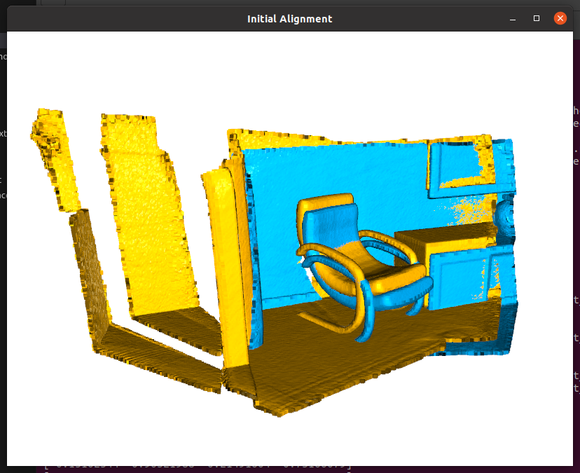
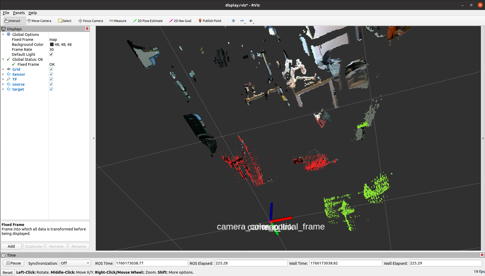

# PointCloud Registration

这个功能包是基于 open3d 实现了 ROS 点云配准服务节点。该仓库的功能在以下配准中通过了测试：

|Device|Plantform|OS|ROS|
|--|--|--|--|
|Nvidia Jetson Orin| Arm64 | Ubuntu 20.04 | Noetic|


If you want to read the English version, you can view this file: [ReadMe-EN](./resources/ReadMe-EN.md)

如果你想要阅读英语版本可以查看这个文件：[ReadMe-EN](./resources/ReadMe-EN.md)


---

# Contributors

该工程由 `中国科学院自动化研究所` 提供硬件与测试场地，同时以下人员在该项目的开发中做出了巨大贡献，在此感谢他们的付出：

[WenJiang Xu 徐文江](https://github.com/HEA1OR)，[PengFei Yi 易鹏飞](https://github.com/alfie010)，[JingKai Xu 徐靖凯](https://github.com/Triumphant-strain)，[XingYu Wang 王行宇](https://github.com/xywang227)，[YaNan Hao 郝亚楠](https://github.com/haoyanan2024)，[YuWei Wang 王雨薇](https://github.com/YuweiWang2002)


----
# 如何使用

## Step1. 拉取该仓库

进入到你的工作空间中拉取该仓库，假设你的工作空间为 `reg_ws`：

```bash
$ cd reg_ws/src
$ git clone https://github.com/GaohaoZhou-ops/pointcloud_registration.git
```

---

## Step2. 创建虚拟环境

新建一个 conda 环境并安装以下依赖:

```bash
$ conda create -n o3d python=3.10
$ pip install open3d pyyaml rospkg numpy==1.24.3
```

---

## Step3. 编译工作空间

返回到工作空间目录下编译该空间，编译成功后激活 conda 环境：

```bash
(base) $ cd reg_ws
(base) $ conda deactivate 
(base) $ catkin_make

(base) $ conda activate o3d
```

## Step4. [可选] 运行测试样例

在使用之前可以先运行测试脚本以确保 open3d 配准功能正常。如果你不想要打开 GUI 界面，修改脚本中的 `DISPLAY` 变量为 `False`：

```bash
(o3d) $ python src/pointcloud_registration/scripts/test_without_ros.py demo
```

|配准前|配准后|
|--|--|
|||


如果你在运行后遇到了 `Segmentation Fault` 问题，有可能是由于 `numpy` 版本导致的，将其降级为 `1.xx` 版本：

```bash
(o3d) $ pip install -U numpy==1.24.3
```

----

## Step5. [可选] 构建target点云

我们建议使另外一个开源的 RGBD 重建仓库创建 target 点云，或者如果你有带有 Lidar 的 iPhone 设备可以下载 App Store 中的 `3D Scanner` 软件扫描你感兴趣的物体用于重建。

如果上述条件你都不具备，那么运行下面的节点来采集当前帧点云：

```bash
(o3d) $ roslaunch pointcloud_registration allocate_pcd.launch
```

该 launch 文件中以下变量会影响点云保存质量：

* `accumulation_seconds`：累积点云时长，时间越小点云越稀疏；
* `voxel_size`：体素滤波大小，值越小点云越精细；


调用服务并传入参数，如果你不修改 `min max` 参数则会使用 bounding box 范围为 `x=[-1.0,1.0], y=[-1.0,1.0], z=[-1.0,1.0]`：

```bash
(o3d) $ rosservice call /pointcloud_accumulator_node/save_cloud "{filename: 'demo', min_x: 0.0, max_x: 0.
0, min_y: 0.0, max_y: 0.0, min_z: 0.0, max_z: 0.0}" 

success: True
message: "Successfully saved point cloud with 6705 points to /home/orin/Desktop/point_reg/src/pointcloud_registration/pcd_files/demo.pcd"
```


---
## Step6. 执行点云配准

在执行脚本之前需要确保 `pcd_files` 文件夹中有你的 target 点云文件，如果你需要保存当前正在使用的 target 和 source 点云用于 debug，可以修改 launch 文件中的 `write_file` 参数。

```bash
(o3d) $ roslaunch pointcloud_registration registration.launch
```

该 launch 文件中以下几个变量将影响配准结果：

* `fitness`：配准置信度，当配准重合度低于这个值时返回配准失败；
* `accumulation_seconds`：点云累积时长；
* `voxel_size`：体素滤波大小，该值越小配准耗时越长，但配准越精确；
* `registration_attempts`：点云匹配次数，最终返回的结果是多次匹配取平均值；

调用服务并将 target 点云文件名作为参数 `target_cloud_name` 传入：

```bash
(o3d) $ rosservice call /pointcloud_registration_node/register "{target_cloud_name: 'demo', voxel_size: 0.0, max_correspondence_distance: 0.0, crop_min_x: 0.0,
  crop_max_x: 0.0, crop_min_y: 0.0, crop_max_y: 0.0, crop_min_z: 0.0, crop_max_z: 0.0}" 

success: True
message: "Registration successful with fitness score: 0.9940"
transformation: 
  translation: 
    x: -0.060025553054253854
    y: 0.03020713014616973
    z: -0.00028744602569820155
  rotation: 
    x: 0.019895079499856496
    y: -0.06213543298323554
    z: -0.0037846292055216057
    w: 0.9978622401721878
```




---
# 更新日志

* 2025-10-17:
  * 在采集点云的时候可以选择采集着色点云；
  * 在配准时添加了多次配准功能；
* 2025-10-14: 
  * 在采集点云时候添加了累积时间功能，使得点云采集更稠密；
  * 在采集点云时添加了frame参数，可以采集指定坐标系下的点云；
* 2025-10-13: 
  * 初始化仓库；
