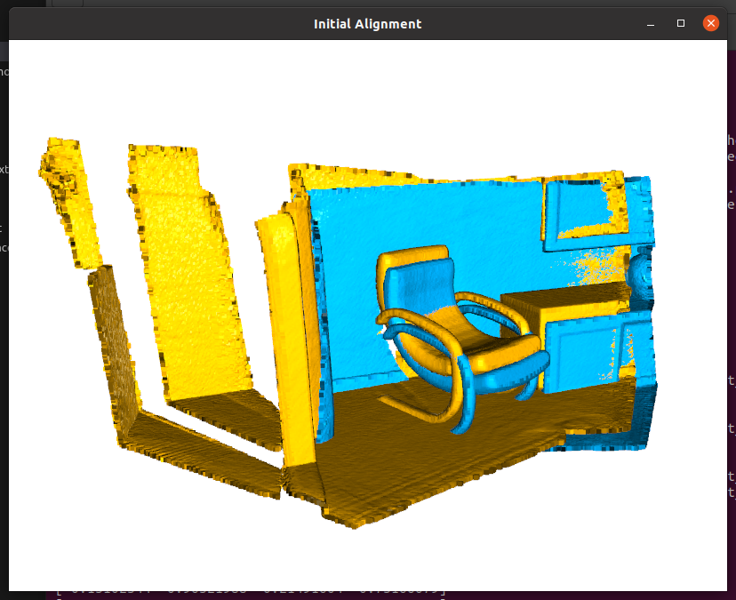
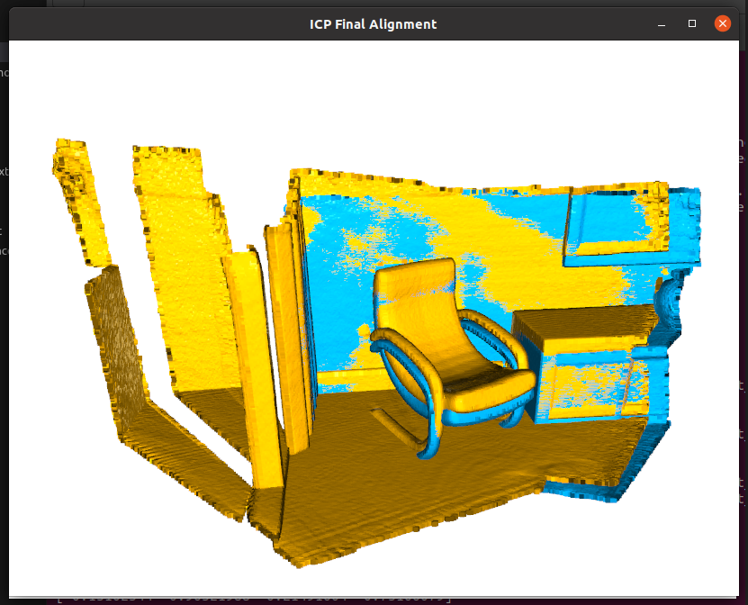
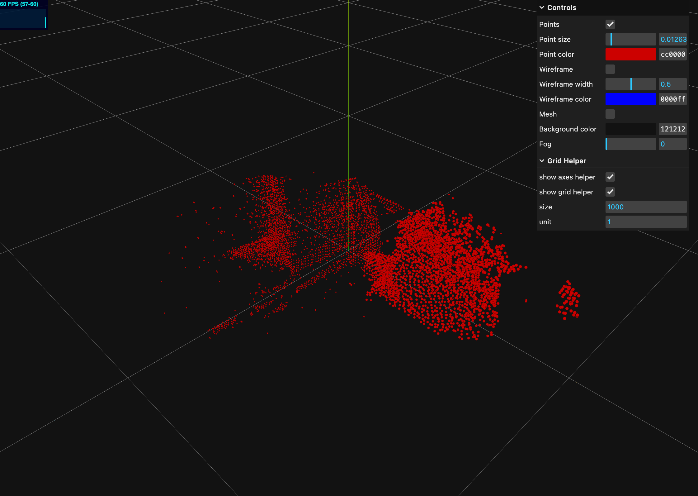
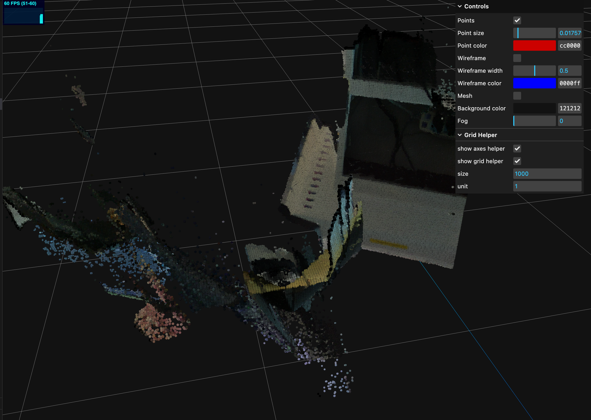
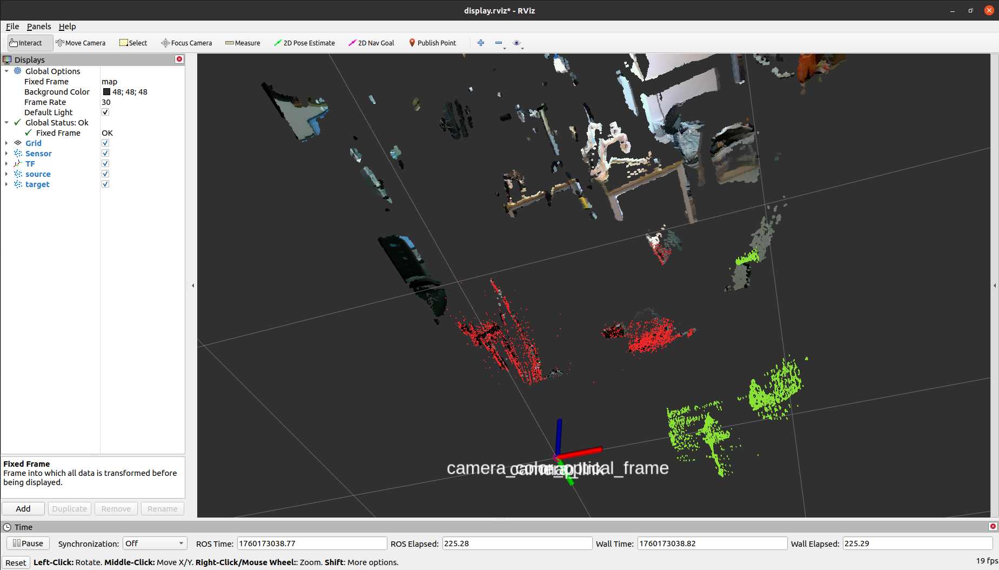

# PointCloud Registration

This package implements the ROS point cloud registration service node based on open3d.

The functionality of this repository has been tested in the following alignments:

|Device|Plantform|OS|ROS|
|--|--|--|--|
|Nvidia Jetson Orin| Arm64 | Ubuntu 20.04 | Noetic|


If you want to read the Chinese version, you can view this file: [ReadMe](../README.md)


---

# Contributors

The hardware and testing facilities for this project were provided by the `Institute of Automation, Chinese Academy of Sciences`. The following individuals made significant contributions to the development of this project, and we would like to thank them for their efforts:


[WenJiang Xu 徐文江](https://github.com/HEA1OR)，[PengFei Yi 易鹏飞](https://github.com/alfie010)，[JingKai Xu 徐靖凯](https://github.com/Triumphant-strain)，[XingYu Wang 王行宇](https://github.com/xywang227)，[YaNan Hao 郝亚楠](https://github.com/haoyanan2024)，[YuWei Wang 王雨薇](https://github.com/YuweiWang2002)


----
# How to Use

## Step1. Clone this repo

Enter your workspace and pull the repository. Assume your workspace is `reg_ws`:


```bash
$ cd reg_ws/src
$ git clone https://github.com/GaohaoZhou-ops/pointcloud_registration.git
```

---

## Step2. Create conda env

Create a new conda environment and install the following dependencies:


```bash
$ conda create -n o3d python=3.10
$ pip install open3d pyyaml rospkg numpy==1.24.3
```

---

## Step3. Build Workspace

Return to the workspace directory and compile the space. After the compilation is successful, activate the conda environment:


```bash
(base) $ cd reg_ws
(base) $ conda deactivate 
(base) $ catkin_make

(base) $ conda activate o3d
```

## Step4. [optional] Run Test

Before using it, you can run the test script to ensure that the open3d registration function is normal. If you do not want to open the GUI interface, modify the `DISPLAY` variable in the script to `False`:


```bash
(o3d) $ python src/pointcloud_registration/scripts/test_without_ros.py demo
```

|Before Reg|After Reg|
|--|--|
|||


If you get `Segmentation Fault` after running, it may be caused by the `numpy` version. Downgrade it to `1.xx` version:


```bash
(o3d) $ pip install -U numpy==1.24.3
```

----

## Step5. [optional] Create Target File

We recommend using another open source RGBD reconstruction repository to create the target point cloud, or if you have an iPhone device with LiDAR, you can download the `3D Scanner` software from the App Store to scan the object of interest for reconstruction.

If you do not meet the above conditions, run the following node to collect the point cloud of the current frame:

```bash
(o3d) $ roslaunch pointcloud_registration allocate_pcd.launch
```

The following variables in the launch file affect the quality of point cloud saving:


* `accumulation_seconds`：The accumulation time of point cloud. The smaller the time, the sparser the point cloud;
* `voxel_size`：Voxel filter size, the smaller the value, the finer the point cloud;

Call the service and pass in the parameters. If you don't modify the `min max` parameters, the bounding box range will be used as `x=[-1.0,1.0], y=[-1.0,1.0], z=[-1.0,1.0]`:


```bash
(o3d) $ rosservice call /pointcloud_accumulator_node/save_cloud "{filename: 'demo', min_x: 0.0, max_x: 0.
0, min_y: 0.0, max_y: 0.0, min_z: 0.0, max_z: 0.0}" 

success: True
message: "Successfully saved point cloud with 6705 points to /home/orin/Desktop/point_reg/src/pointcloud_registration/pcd_files/demo.pcd"
```

|Pure Point Cloud|Colored Point Cloud|
|---|---|
|||


---
## Step6. Use Point Cloud Register

Before executing the script, you need to make sure that your target point cloud file is in the `pcd_files` folder. If you need to save the target and source point clouds currently in use for debugging, you can modify the `write_file` parameter in the launch file.


```bash
(o3d) $ roslaunch pointcloud_registration registration.launch
```

The following variables in the launch file will affect the registration results:


* `fitness`：Registration confidence: when the registration coincidence is lower than this value, registration failure is returned;
* `accumulation_seconds`：Source point cloud accumulation time. source;
* `voxel_size`：Voxel filter size. The smaller the value, the longer the registration takes, but the more accurate the registration;
* `registration_attempts`：The number of point cloud matches, the final result returned is the average of multiple matches;

Call the service and pass the target point cloud file name as the `target_cloud_name` parameter:


```bash
(o3d) $ rosservice call /pointcloud_registration_node/register "{target_cloud_name: 'demo', voxel_size: 0.0, max_correspondence_distance: 0.0, crop_min_x: 0.0,
  crop_max_x: 0.0, crop_min_y: 0.0, crop_max_y: 0.0, crop_min_z: 0.0, crop_max_z: 0.0}" 

success: True
message: "Registration successful with fitness score: 0.9940"
transformation: 
  translation: 
    x: -0.060025553054253854
    y: 0.03020713014616973
    z: -0.00028744602569820155
  rotation: 
    x: 0.019895079499856496
    y: -0.06213543298323554
    z: -0.0037846292055216057
    w: 0.9978622401721878
```




---
# Updata Logs

* 2025-10-17:
  * Add color point cloud allocator.
  * Add registration operation attemps counts.
* 2025-10-14: 
  * Add accumlate attribute when using point cloud registration;
  * Add tf transform when accumulate point cloud.
* 2025-10-13: 
  * Init repo;
